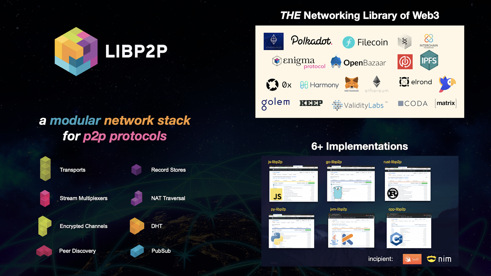

**libp2p is the networking & communication layer** for IPFS. [Visit the main website](https://libp2p.io/) for resources and information.

Moving from a location-addressed system to a peer-to-peer, content addressed system presents a lot of challenges. The internet as it is, with firewalls and NATs, was designed to provide data (securely) for the traditional Web2 systems.

libp2p is a modular system of *protocols*, *specifications* and *libraries* that enable the development of peer-to-peer network applications. Because of the way libp2p is architected, a lot of the needs and considerations that the web2 network was built on no longer apply.

**[See the Implementations and Bundles](https://libp2p.io/implementations/)** for all of the libraries of modules you can use and bundles for different use cases available in various languages.

## Learning Objectives

### Shallow Dive Goals

* **1.0 -** Understand how and why libp2p was created, and what the different modular components and concepts are
* **1.1 -** Know the difference between peer-to-peer and client-server communication models
* **1.2 -** Comprehend the difference between identities being tied to location addresses in client-server world and only tied to peer ids in peer-to-peer world
* **1.3 -** Understand the technical & political benefits and challenges of peer-to-peer architectures

### Deep Dive Goals

* **1.4 -** Understand libp2p’s project architecture, a single core + many composable building blocks
* **1.5 -** Understand the difference gossiping protocol (GossipSub) and a data exchange protocol (BitSwap), and how each is used
* **1.6 -** Understand the variety of modules that can be implemented in libp2p and what they’re used for, including how they are included in a project’s architecture